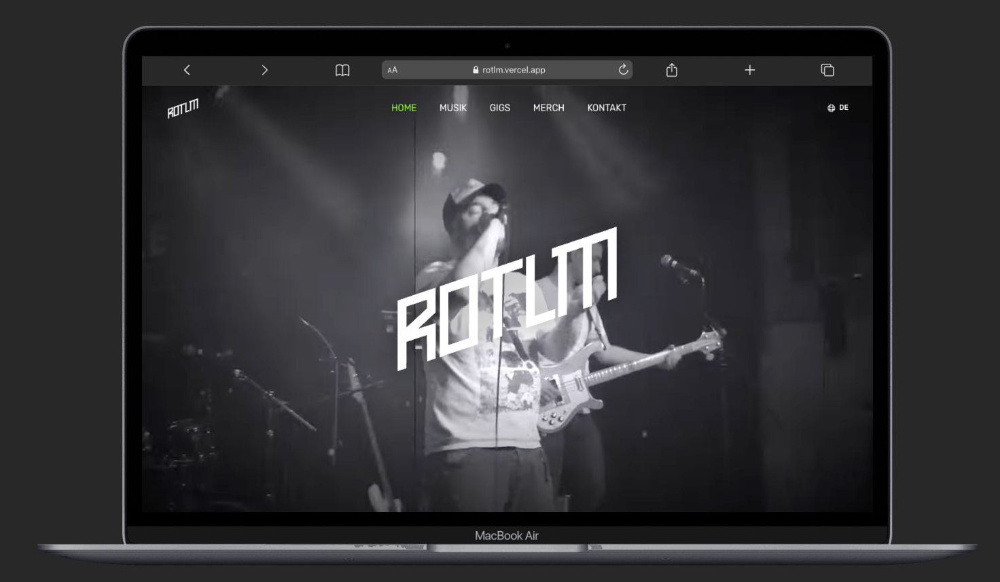
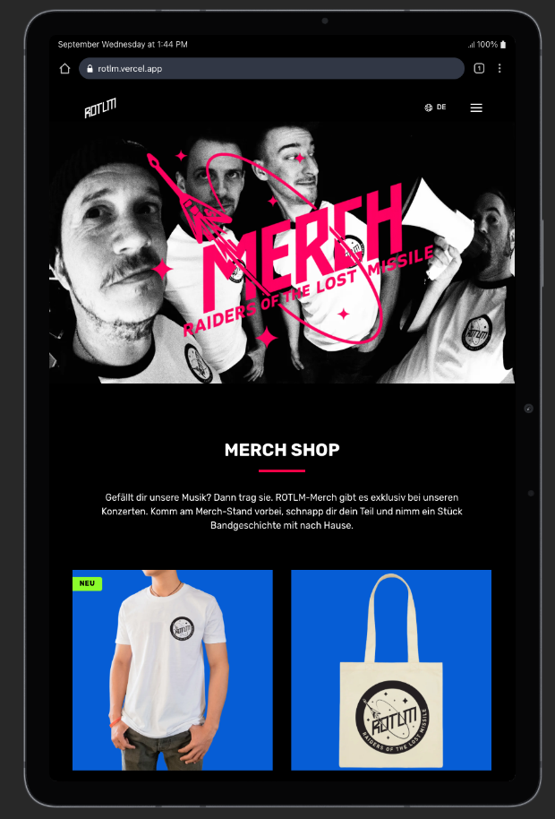
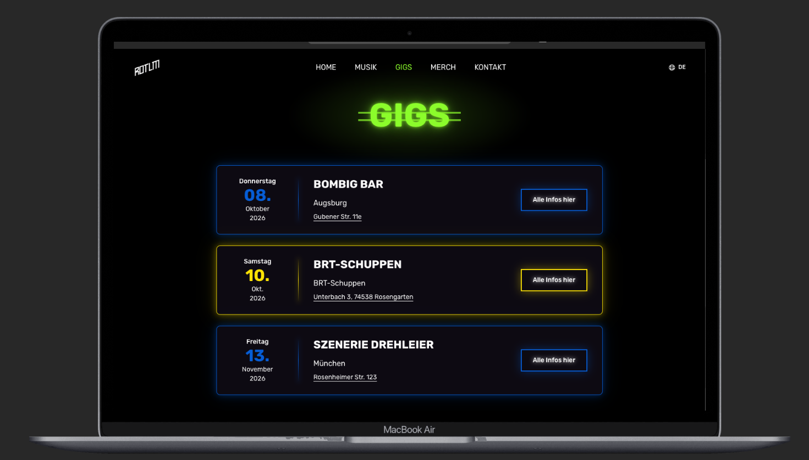
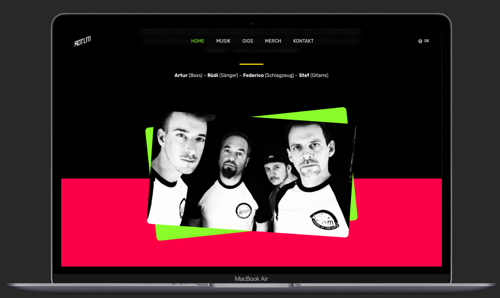
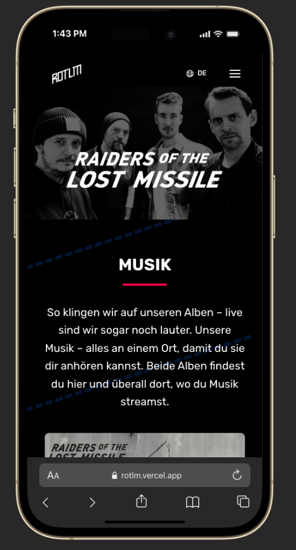
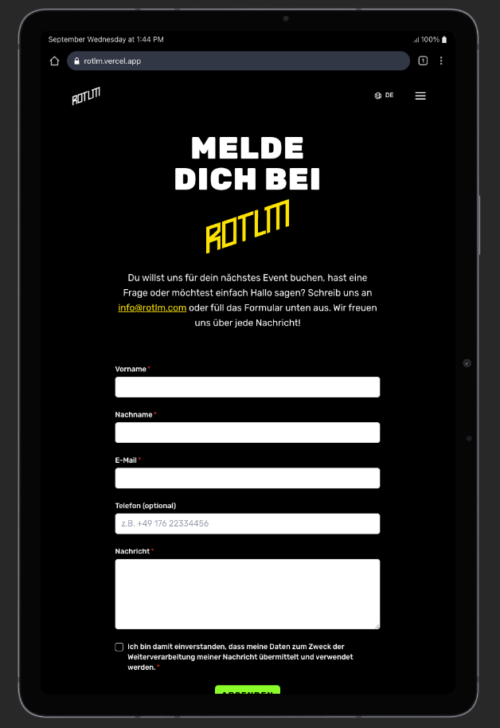

# Raiders of the Lost Missile

Built for the Munich rock band Raiders of the Lost Missile: the band manages gigs, music, merch and texts themselves through the CMS Sanity Studio. Currently on a staging URL while the band finalises content; launch on rotlm.com is planned for December 2026.

**Staging:** [rotlm.vercel.app](https://rotlm.vercel.app)

A multilingual, content-managed band website built with Nuxt 4, with a focus on fast loads on phones and on letting non-technical people keep the site up to date without a developer.

## Screenshots

<table>
  <tr>
    <td width="50%"></td>
    <td width="50%"></td>
  </tr>
  <tr>
    <td align="center"><sub>Home hero with background video</sub></td>
    <td align="center"><sub>Merch showcase (tablet)</sub></td>
  </tr>
  <tr>
    <td width="50%"></td>
    <td width="50%"></td>
  </tr>
  <tr>
    <td align="center"><sub>Upcoming gigs, managed in Sanity</sub></td>
    <td align="center"><sub>Band section</sub></td>
  </tr>
  <tr>
    <td width="50%"></td>
    <td width="50%"></td>
  </tr>
  <tr>
    <td align="center"><sub>Music page (mobile)</sub></td>
    <td align="center"><sub>Contact form (tablet)</sub></td>
  </tr>
</table>

## Features

- **Self-service content.** Gigs, albums, merch, band texts and images are edited in Sanity Studio and appear on the site within a minute, no deploy needed.
- **Four languages.** German (default), English, Italian and Spanish, for both the UI and the CMS content.
- **SEO.** Per-page meta and Open Graph tags, `hreflang` links, canonical URLs, a generated sitemap and `MusicGroup` structured data.
- **Gigs.** Upcoming concerts are listed with venue, address and map link; past ones move to a "past gigs" list automatically.
- **Music.** Album covers with embedded Spotify players.
- **Merch.** Product showcase with "new" badges; items are sold at concerts, so there is no checkout.
- **Contact form.** Client- and server-side validation, GDPR consent, delivered by email through Resend.
- **Motion.** Background video hero, scroll-triggered animations and neon effects that match the band's visual identity.

## Tech stack

| Frontend | Content & infrastructure |
| --- | --- |
| [Nuxt 4](https://nuxt.com) / Vue 3 / TypeScript | [Sanity](https://www.sanity.io) headless CMS + Sanity Studio |
| [Tailwind CSS v4](https://tailwindcss.com) + [Nuxt UI](https://ui.nuxt.com) | Sanity image CDN for responsive image renditions |
| [@nuxtjs/i18n](https://i18n.nuxtjs.org) | [Cloudinary](https://cloudinary.com) for video renditions |
| [VueUse Motion](https://motion.vueuse.org) / [motion-v](https://motion.dev/docs/vue) | [Resend](https://resend.com) for transactional email |
| [Yup](https://github.com/jquense/yup) form validation | Nitro server routes (Sanity proxy, contact endpoint, sitemap) |
| | [Vercel](https://vercel.com) with ISR |

## Engineering decisions

**Instant page loads on a serverless host.** The site runs on Vercel's free tier, where a cold serverless render plus Sanity round trips took 2–3 s. Every page and the Sanity API proxy are now served with [ISR route rules](nuxt.config.ts): visitors always get the stored copy at once (~0.1 s), while a copy older than 60 s is refreshed in the background. To make the home page cacheable, the browser-language redirect was dropped in favour of `hreflang` links and the language menu.

**Media sized for the device.** Sanity image URLs get width/format parameters and are rendered with `srcset`/`sizes` ([`sanityImage.ts`](app/utils/sanityImage.ts)), so a phone downloads a 768 px WebP rather than the multi-megabyte original. The hero video is delivered by Cloudinary in three size/quality tiers, and its poster is a plain `` so the first paint does not wait for the video ([`HeroVideo.vue`](app/components/base/HeroVideo.vue)).

**No loading states on navigation.** Page content is prefetched when a nav link is hovered or during idle time, and a [global route middleware](app/middleware/page-data.global.ts) awaits it before the route changes. The new page renders complete on the first frame; hero images are warmed too, so there is no flash of an empty hero ([`usePrefetchPageData.ts`](app/composables/usePrefetchPageData.ts)).

**Tracking down a silent animation bug.** After client-side navigation, some scroll animations stopped firing and images stayed invisible. The cause was components with `await` in `<script setup>`: when several resolved in the same tick, Vue's effect-scope bookkeeping interleaved and watchers created later attached to the wrong component and died with it. The fix was structural — no async setup anywhere, with data resolved in the middleware instead ([`useSanity.ts`](app/composables/useSanity.ts) documents the constraint for future changes).

**Sanity behind a server proxy.** The browser never talks to Sanity directly. A Nitro route ([`server/api/sanity/[...query].ts`](server/api/sanity/[...query].ts)) holds the GROQ queries, returns only the fields each page needs, and is cached with the same ISR rules as the pages, so a content edit is one request away from every visitor without the Sanity client ever shipping to the browser.

## Project structure

```
app/
  pages/            index, gigs, music, merch, contact, impressum, datenschutz
  components/       AppHeader, ContactForm, base/ (hero, band, gigs, albums, merch, ...)
  composables/      useSanity (typed data access), usePrefetchPageData, useFormValidations
  middleware/       page-data.global.ts (awaits page content before navigation)
  utils/            sanityImage.ts (responsive Sanity image URLs)
  assets/css/       Tailwind config, fonts, neon/animation utilities
server/
  api/sanity/       GROQ queries and Sanity proxy
  api/contact.post.ts   contact form endpoint (Resend)
  routes/sitemap.xml.ts
studio/             Sanity Studio with the content schemas (schemaTypes/)
i18n/locales/       de, en, it, es UI strings
```

## Running locally

Requires Node 20+ and Yarn 1.

```bash
yarn install
```

Create a `.env` file in the project root:

```bash
NUXT_RESEND_API_KEY=        # Resend API key (contact form)
NUXT_RESEND_TO_EMAIL=       # address that receives contact messages
```

The Sanity dataset is public (read-only), so no token is needed to run the site.

```bash
yarn dev          # http://localhost:3000
yarn lint         # ESLint (antfu config)
yarn build        # production build
```

Sanity Studio runs separately:

```bash
cd studio && yarn install && yarn dev   # http://localhost:3333
```

## Roadmap

- Custom domain and go-live (December 2026)
- On-demand revalidation from a Sanity webhook instead of the 60 s window
- Trim client JavaScript by consolidating the two animation libraries
- Structured data (`MusicEvent`) for the gigs list
